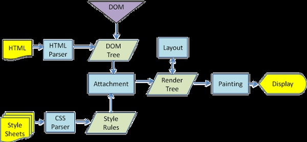

##解析顺序：从右往左



在图中我们可以看到HTML解析出了一颗DOM tree，与此同时样式脚本则解析生成了一个style rules，也可以说是一个CSS tree。最后，DOM tree同style rules一同结合解析出一颗Render Tree，而Render Tree就是包含了一个dom对象以及为其计算好的样式规则，提供了布局以及显示方法。

因为不清楚一个DOM对象上究竟对应着哪些样式规则，所以只能选择一个最笨的办法，即每一个DOM对象都遍历一遍style rules，DOM对象的数量相信大家也都清楚，如果每次遍历style rules都是像一个晒太阳的老大爷一样的悠哉游哉，那么鼠标厂商应该会很开心，嗯，摔坏了正好买新的嘛~~~因此对CSS选择器进行优化就是一个必须的事情了。
```css
#div1 .c .d{}
.f .c .d{}
.a.c.e{}
#div1.f{}
.c.d{}
```
## 左到右：

首先，#div1 .c .d｛｝.f.c.d｛｝.c.d｛｝这三个选择器里面都含有.c.d｛｝这么一个公用样式，所以哪怕是我们的DOM节点明确了是在#div1下面都必须对style rules进行全部的匹配查找，这样一来基本上可以说是每一个DOM节点都必须完全遍历一遍styl rules，不然搞不好就会漏掉一些公用样式之类的，所以想着将层级写的更加详细就能去掉很多不对应的CSS选择器的索引路径的就不要想了，不管你写的多细，你总是需要把整个style rules都遍历一遍，不然万一漏掉了某个公用样式不就思密达了？
## 右到左边：

别的先不提，最少这个节点就少了很多嘛，哪怕我这里同样是需要全部遍历一遍就冲着减少了这么多个节点也要从右往左进行解析啊！
更重要的是，只要有公用样式，那么选择器最右边的那个类型选择器一定是相同的，如此公共样式就很自然的都集中到一个分支上，这个时候我们完全可以将其他不匹配的路径全部去掉而不用担心会漏掉某些个公用样式了。虽然当这颗CSS树在遍历的时候还有有部分节点会遍历到最后才能确定到底是不是匹配的，但总的来说从右往左进行解析还是会比从左往右解析要少很多次的匹配，这样带来的效率提升是显而易见的！
同时，这也是不建议使用*通配符来进行样式匹配的原因：浏览器专门建立了一个反常规思维的从右往左的匹配规则就是为了避免对所有元素进行遍历，你直接一个通配符等于之前的工作都白做了。
最后，从右往左进行解析还有一个好处那就是从右往左进行匹配的时候，匹配的全部是DOM元素的父节点，而从左往右进行匹配的时候时候，匹配的全部是DOM元素的子节点，这样就避免了HTML与CSS没有下载完需要进行等待的情形。